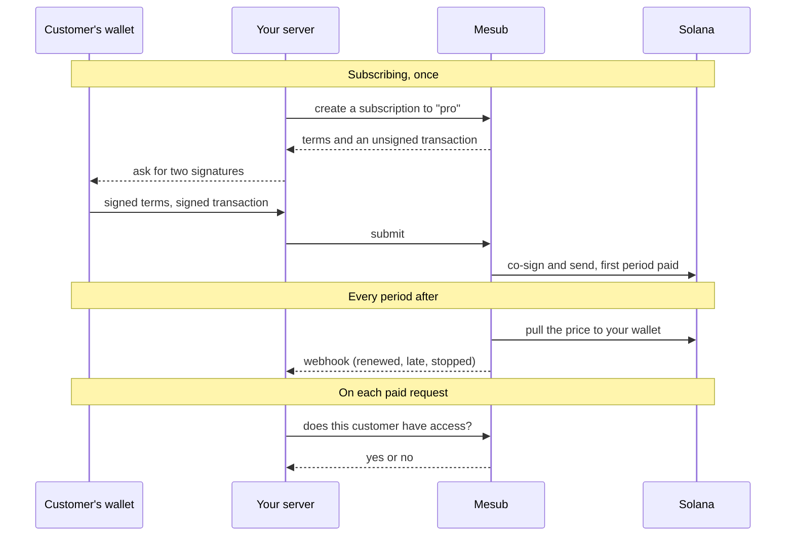

A customer approves a plan once. After that, Mesub pulls the plan's price from
their wallet to yours at every period, and your server asks Mesub whether a
given customer has access.

## The flow

Your pages never call Mesub and never hold a key. The wallet signs in the
browser, and everything else goes through your server.

## What runs where

| Where       | What it does                                              | What it holds             |
| ----------- | --------------------------------------------------------- | ------------------------- |
| Your pages  | Ask the wallet for its two signatures                     | Nothing secret            |
| Your server | Creates subscriptions, checks access, receives webhooks   | The API key               |
| Mesub       | Sends each charge, retries a missed one, records attempts | No funds                  |
| Solana      | Holds the plan's terms and moves the tokens               | The customer's delegation |

Your customer has no Mesub account. Mesub finds them by the id you give them
(`external_id`), by the wallet that pays, or by their email.

## The on-chain program

Mesub does not hold or route the money. Plans and subscriptions live in the
[subscriptions program](https://github.com/solana-foundation/subscriptions)
published by the Solana Foundation, which is open source
([MIT](https://github.com/solana-foundation/subscriptions/blob/main/LICENSE))
and [audited by Cantina](https://github.com/solana-foundation/subscriptions/blob/main/audits/AUDIT_STATUS.md).
Its address is `De1egAFMkMWZSN5rYXRj9CAdheBamobVNubTsi9avR44`.

When a customer subscribes, their wallet delegates one thing: the plan's price
may be pulled once per period, to the plan's destination. The plan's price,
token, period and destination are fixed when the plan is created. The customer
can cancel on chain at any time, with or without Mesub.

What Mesub adds on top is the operations: sending each pull on time, retrying
the ones that fail, keeping the record of every attempt, and answering your
server.

## Next

- [Your first subscriber](./quickstart.mdx): a plan, an API key, and the code.
- [`@mesub/node`](https://github.com/Mesub-io/node-sdk), the server SDK.
- [`@mesub/react`](https://github.com/Mesub-io/react-sdk), the optional subscribe button.
